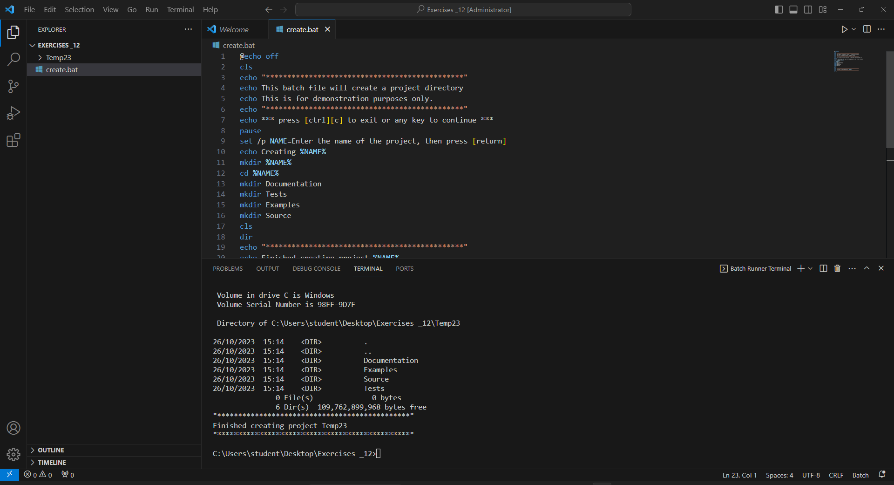

# Batch File

First, I’m going to create a basic directory structure for the project.&#x20;

My root directory is called Exercises\_12.&#x20;

I’m going to store any packages in a directory called source, I also have Tests, Examples, Documentation. By now, you should know what will be in those directories!&#x20;

I write a simple batch file to create the necessary directories.

I’m calling my project **Temp23** and my batch file is **create.bat**; this layout was for a C project.

```
@echo off
cls
echo "**********************************************"
echo This batch file will create a project directory
echo This is for demonstration purposes only.
echo "**********************************************"
echo *** press [ctrl][c] to exit or any key to continue ***
pause 
set /p NAME=Enter the name of the project, then press [return]  
echo Creating %NAME%
mkdir %NAME%
cd %NAME%
mkdir Documentation
mkdir Tests
mkdir Examples
mkdir Source
cls
dir
echo "**********************************************"
echo Finished creating project %NAME%
echo "**********************************************"
cd ..

```

I write this in Visual Studio Code, save it and run.

<figure><figcaption></figcaption></figure>

This was the most simple template batch file I could write. I could have copied libraries, helpme files, etc. at the same time.

I could do the same thing in Linux with a shell script.

```
#!/bin/bash

#clear
echo "**********************************************"
echo This script will create a project directory
echo "**********************************************"
echo "*** press [ctrl][c] to exit or [return] to continue ***"
read
echo "Enter the name of the project, then press [return]"
read NAME
echo "Creating directory" $NAME

if [ -d $NAME ]; then
  echo "Directory exists" $NAME
  cd $NAME
else
  echo "Creating directory" $NAME
  mkdir $NAME
  cd $NAME
fi

mkdir Documentation
mkdir Tests
mkdir Examples
mkdir Source

ls -l
cd ~

echo "**********************************************"
echo "Finished creating project $NAME"
echo "**********************************************"
```

## Exercise

Think through what the directories should be on a Python project. Consider what templates you might want to include. Write a batch file in DOS and Linux to implement this and save it in your Templates repo.
